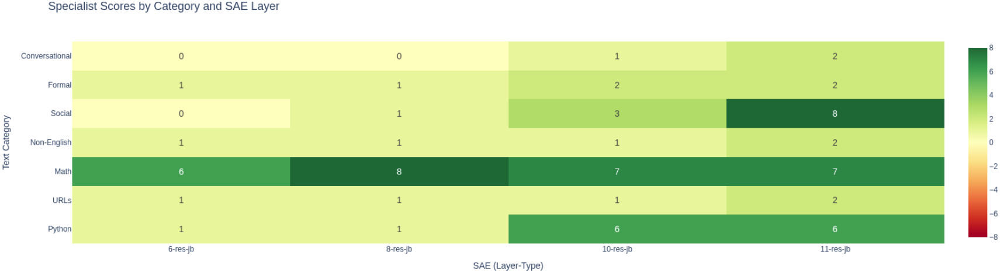
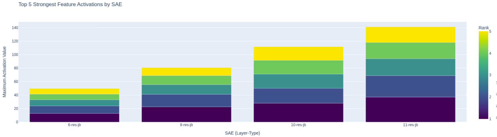
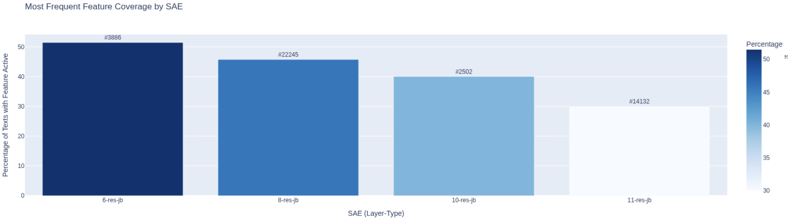
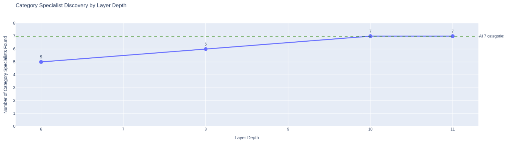
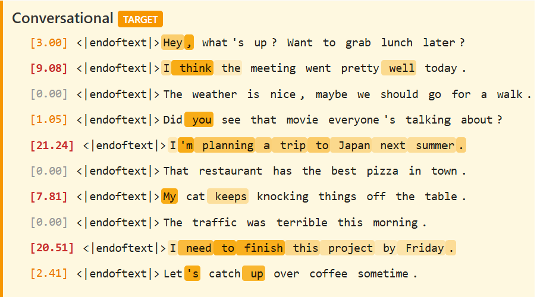

# LLM Interpretability Prototyping

## Project Purpose

This project is an educational exploration of Large Language Model (LLM) interpretability techniques, specifically focusing on **Sparse Autoencoders (SAEs)** as demonstrated in Anthropic's research: [Scaling Monosemanticity](https://transformer-circuits.pub/2024/scaling-monosemanticity/index.html).

### Core Concept

Sparse Autoencoders help us understand what's happening inside neural networks by:
- **Disaggregating** dense, polysemantic activations (where each dimension represents multiple concepts)
- **Into** sparse, monosemantic features (where each feature represents a single interpretable concept)

This transformation makes it possible to see what an LLM is "thinking about" when processing text.

## Project Goals

1. Build hands-on understanding of SAE-based interpretability
2. Visualize how LLM internal representations can be decomposed into interpretable features
3. Explore which features activate for different inputs
4. Create a foundation for more advanced interpretability experiments

---

## Getting Started

### Prerequisites
- Python 3.9+
- 8GB+ RAM
- Internet connection for initial model/SAE downloads

### 1. Clone the Repository
```bash
git clone <repository-url>
cd interpretability-prototyping
```

### 2. Create and Activate Virtual Environment
```bash
# Create virtual environment
python3 -m venv venv

# Activate it (Linux/Mac/WSL)
source venv/bin/activate

# Activate it (Windows)
venv\Scripts\activate
```

### 3. Install Dependencies
```bash
pip install --upgrade pip
pip install torch torchvision --index-url https://download.pytorch.org/whl/cpu
pip install transformer-lens sae-lens
pip install transformers datasets einops
pip install plotly jupyter ipywidgets
pip install numpy pandas matplotlib
```

Or install from requirements file:
```bash
pip install -r requirements.txt
```

### 4. Download Pre-trained SAEs (Optional but Recommended)
Download SAEs via terminal to avoid Jupyter progress bar issues:
```bash
# Download Layer 6 SAE
python3 -c "from sae_lens import SAE; SAE.from_pretrained('gpt2-small-res-jb', 'blocks.6.hook_resid_pre', 'cpu'); print('✅ Layer 6 downloaded')"

# Download additional layers as needed (8, 10, 11)
python3 -c "from sae_lens import SAE; SAE.from_pretrained('gpt2-small-res-jb', 'blocks.8.hook_resid_pre', 'cpu'); print('✅ Layer 8 downloaded')"
python3 -c "from sae_lens import SAE; SAE.from_pretrained('gpt2-small-res-jb', 'blocks.10.hook_resid_pre', 'cpu'); print('✅ Layer 10 downloaded')"
python3 -c "from sae_lens import SAE; SAE.from_pretrained('gpt2-small-res-jb', 'blocks.11.hook_resid_pre', 'cpu'); print('✅ Layer 11 downloaded')"
```

Move downloaded SAEs to a consistent cache location:
```bash
# Create cache directory if needed
mkdir -p ~/.cache/sae_lens

# Copy SAEs (use -rL to dereference symlinks)
cp -rL ~/.cache/huggingface/hub/models--jbloom--GPT2-Small-SAEs-Reformatted/snapshots/*/blocks.*.hook_resid_pre ~/.cache/sae_lens/
```

### 5. Launch Jupyter and Run Notebooks

**Option A: Command Line**
```bash
jupyter notebook
```
Then navigate to `notebooks/` and open the desired notebook.

**Option B: VSCode**
1. Open the project folder in VSCode
2. Open any `.ipynb` file in the `notebooks/` folder
3. Select the `venv` Python interpreter (bottom right of VSCode)
4. Run cells with Shift+Enter

### 6. Run Notebooks in Order

The notebooks are designed to be run sequentially:

| Notebook | Description |
|----------|-------------|
| `notebooks/phase_1.ipynb` | Initial setup, model loading, basic SAE exploration |
| `notebooks/phase_2_feature_exploration.ipynb` | Feature analysis, heatmaps, specialist search |
| `notebooks/phase_3_SAE_comparison.ipynb` | Multi-SAE comparison across layers |

### Troubleshooting

**Model/SAE download stalls in Jupyter:**
- Use terminal downloads as shown in Step 4 above
- Then use `SAE.load_from_disk(path)` in notebooks

**Import errors:**
- Verify virtual environment is activated: `which python` should show `venv/bin/python`
- Reinstall dependencies: `pip install -r requirements.txt`

**SAE loading hangs:**
- Check if files exist: `ls ~/.cache/sae_lens/`
- Ensure files are actual files, not broken symlinks: `ls -la ~/.cache/sae_lens/blocks.6.hook_resid_pre/`

---

## Current Status

✅ **Phase 1: Initial Setup & Exploration** - COMPLETED (2025-10-23)
✅ **Phase 2: Feature Exploration & Analysis** - COMPLETED (2025-11-05)
✅ **Phase 3: SAE Comparison & Advanced Analysis** - COMPLETED (2025-12-02)


---

## Project Structure

```
interpretability-prototyping/
├── README.md                          # This file
├── notebooks/
│   ├── phase_1.ipynb                  # Phase 1 ✅ COMPLETE
│   └── phase_2_feature_exploration.ipynb # Phase 2 ✅ COMPLETE
├── src/                               # Future: Refactored code
├── data/                              
│   ├── phase1_activations.pt          # Cached activations from Phase 1
│   └── .gitignore
├── outputs/                           
│   └── .gitignore
├── requirements.txt                   # Python dependencies
└── .gitignore
```

---

## Roadmap

### Phase 1: Environment Setup & Exploration ✅ COMPLETED
**Goal:** Get familiar with existing interpretability tools using off-the-shelf libraries

**Tasks:**
- [x] Initialize Git repository and create project structure
- [x] Set up Python environment with required dependencies
- [x] Create initial Jupyter notebook for experimentation
- [x] Load a small pre-trained model (GPT-2 small) using TransformerLens
- [x] Explore pre-trained SAEs using SAELens library
- [x] Visualize basic activation patterns
- [x] Use Neuronpedia to understand what interpretable features look like
- [x] Successfully load and use real pre-trained SAE
- [x] Extract and analyze activations from GPT-2
- [x] Compare dense vs sparse representations
- [x] Investigate specific features and their meanings
- [x] Extract activations from sample texts
- [x] Cache activations to disk for reuse

**Key Achievements:**
- Successfully loaded GPT-2 small (768-dimensional activations)
- Loaded pre-trained SAE (24,576 features with 32x expansion)
- Extracted activations from Layer 6 residual stream (`blocks.6.hook_resid_pre`)
- Achieved 87.35% sparsity (only 3,108/24,576 features active)
- Investigated Feature #10399 using Neuronpedia
- Saved activation cache for future use
- Extracted and cached activations from 4 initial sample texts

**Key Libraries Used:**
- `transformer-lens`: Model internals access
- `sae-lens`: Pre-trained SAE loading
- `transformers`: HuggingFace base library
- `torch`: PyTorch for tensor operations
- `plotly`: Interactive visualizations

---

### Phase 2: Feature Exploration & Analysis ✅ COMPLETED
**Goal:** Systematically explore and analyze SAE features to understand what patterns they capture

**Tasks:**
- [x] Build diverse test dataset (70 texts across 7 categories)
- [x] Extract features from diverse text types (Python, URLs, Math, Non-English, Social/Emoji, Formal, Conversational)
- [x] Implement multi-criteria feature discovery:
  - Strongest features (highest activation values)
  - Most frequent features (activate across most texts)
  - Most selective features (high activation on few texts)
  - Category-specific analysis (search for specialists)
- [x] Create feature activation heatmaps
- [x] Build interactive feature explorer function
- [x] Analyze feature co-activation patterns
- [x] Find features for specific concepts (with activation strength weighting)
- [x] Integrate Neuronpedia links throughout analysis
- [x] Implement SAE selection mechanism for comparing different decompositions

**Key Achievements:**

**Dataset Construction:**
- Created 70-text diverse dataset spanning 7 categories
- 10 texts per category ensuring balanced representation
- Categories: Python code, URLs/web content, mathematical notation, non-English languages, social media/emoji, formal writing, conversational English

**Feature Discovery Methods:**
- **Strongest Feature**: Feature #10399 (max activation 16.85) - activates on legal text, greetings, and formal language
- **Most Frequent Feature**: Feature #174 (active in 69/70 texts) - extremely general background feature
- **Most Selective Feature**: Feature #174 (strong in only 1/70 texts) - rare but impactful activation
- **Category Specialists**: Found 1 true specialist - Feature #18522 for Math (strong activations in 7/10 Math texts and only 1/60 non-Math texts)

**Key Insights:**
- Most features in the pre-trained SAE (6-res-jb, layer 6 residual stream) are general-purpose
- True category specialists are rare - only 1 found across 7 categories
- Feature #18522 demonstrated genuine specialization for mathematical notation
- General features like #18, #31, #45 activate consistently across all text types
- Composite scoring (frequency × mean activation) provides better ranking than binary presence/absence

**Visualizations:**
- Feature activation heatmaps showing patterns across 70 diverse texts
- Category-wise activation analysis with mean activation by category
- Top 10 frequent features visualization
- Interactive feature explorer for detailed investigation

**Interpretability Findings:**
- SAEs don't always learn clean, monosemantic specialists for every domain
- Most features represent general linguistic patterns (punctuation, structure, syntax)
- Domain-specific patterns (math, code) are captured by combinations of features rather than single specialists
- Looking at activation strength (not just presence) reveals more nuanced feature behavior

**Technical Improvements:**
- Implemented activation strength weighting in concept finding
- Added composite scoring (frequency × strength) for better feature ranking
- Built framework for comparing multiple SAEs (preparation for future work)
- Structured code for easy SAE selection and comparison

**Expected Next Steps:**
- Test additional pre-trained SAEs to find more specialists
- Compare how different SAEs decompose the same activations
- Investigate why some SAEs learn specialists while others learn general features

---

### Phase 3: SAE Comparison & Advanced Analysis ✅ COMPLETED
**Goal:** Compare multiple pre-trained SAEs and understand how training affects feature specialization

**Tasks:**
- [x] Load and test multiple SAEs (layers 6, 8, 10, 11 residual stream)
- [x] Run Phase 2 analysis pipeline on each SAE
- [x] Build comprehensive comparison framework with helper functions
- [x] Create HTML comparison table showing all SAE results side-by-side
- [x] Generate detailed per-SAE text output with Neuronpedia links
- [x] Create DataFrame visualizations showing top 5 strongest features per SAE
- [x] Implement proper padding masking in feature extraction
- [x] Compare specialist features across SAEs
- [x] Analyze which SAE architectures/layers produce better specialists
- [x] Document differences in feature interpretability across layers
- [x] Generate heatmap visualizations comparing all SAEs (specialist scores, activation strengths, frequency, layer progression)
- [x] Generate visualizations that show activation intensity of a given specialist feature when exposed to a block of sample text (akin to approach taken by Anthropic)

**Duration:** ~6 hours

**Key Questions Answered:**
- ✅ **Do deeper layers learn more specialized features?** YES - Layers 10 and 11 achieved 7/7 specialists
- ✅ **Do different layers show qualitatively different feature types?** YES - Clear progression from general to specialized
- ✅ **Can residual stream SAEs learn specialists?** YES - when proper methodology is used
- ✅ **How does feature generality change with depth?** Most frequent feature coverage DECREASES (51% → 30%) as layers deepen, indicating shift from general to specialized representations
- ✅ **Which categories are hardest to specialize?** Social and Conversational - only found in layers 10-11, while Math/Python/URLs found in all layers
- ❓ **Would MLP-output or attention-output SAEs show more specialization?** Not tested - these SAEs are not available for this model release

**SAE Comparison Framework:**
- Implemented modular helper functions: `analyze_strongest()`, `analyze_frequent()`, `analyze_selective()`, `analyze_specialists()`
- Created `extract_features()` function with proper padding masking for consistent feature extraction across SAEs
- Built `display_comparison_table()` with HTML rendering for clear cross-SAE comparison
- Added `neuronpedia_link()` helper for consistent link generation

**SAEs Tested:**
- Layer 6 Residual Stream (`blocks.6.hook_resid_pre`)
- Layer 8 Residual Stream (`blocks.8.hook_resid_pre`)
- Layer 10 Residual Stream (`blocks.10.hook_resid_pre`)
- Layer 11 Residual Stream (`blocks.11.hook_resid_pre`)

**Analysis Pipeline:**
- Strongest feature analysis (top 5 per SAE)
- Most frequent feature analysis (top 5 per SAE)
- Most selective feature analysis (top 5 per SAE)
- Category specialist search across 7 categories

**Visualization Outputs:**
- HTML comparison table with clickable Neuronpedia links
- Per-SAE detailed text output with statistics
- DataFrame showing top 10 activating texts for top 5 strongest features per SAE
- Summary table showing specialist progression across layers
- **Heatmap 1:** Specialist Scores Matrix (Category × SAE) with color-coded scores
- **Heatmap 2:** Top 5 Strongest Feature Activations by SAE (grouped bar chart)
- **Heatmap 3:** Most Frequent Feature Coverage by SAE (bar chart showing % decline)
- **Heatmap 4:** Layer Progression Line Chart (specialists found vs layer depth)
- **Token-Level Highlighting (Cell 13):** Anthropic-style per-token activation visualization showing:
  - Individual token highlighting with opacity proportional to activation strength
  - Hover tooltips displaying exact activation values per token
  - Orange highlighting for target category texts, gray for non-target categories
  - All 70 texts displayed per specialist feature, organized by category
  - Clickable Neuronpedia links for each specialist feature
  - Color-coded activation summaries: red bold (>5.0), orange (1.0-5.0), gray (<1.0)

**Sample Outputs:**

*Specialist Scores by Category and Layer:*



This heatmap shows specialist scores (inside category activation − outside category activation) for each text category across SAE layers. Key observations:
- **Math** (score 6-8): Strong specialists found in all layers
- **Social** (score 0→8): No specialist at layer 6, strongest at layer 11
- **Conversational** (score 0→2): Hardest category to specialize, only emerges in deep layers

*Top 5 Strongest Feature Activations by SAE:*



Peak activation magnitudes increase dramatically with layer depth (~50 at layer 6 → ~140 at layer 11), indicating features become more sharply tuned in later layers.

*Most Frequent Feature Coverage by SAE:*



The most frequent feature's coverage **decreases** with layer depth (51% → 46% → 40% → 30%). This inverse relationship demonstrates that early layers develop general-purpose features (syntax, structure) while deeper layers develop specialized features (domain-specific patterns). Each bar shows a different feature ID, confirming these are distinct features at each layer.

*Category Specialist Discovery by Layer Depth:*



Specialist count increases monotonically with depth: 5/7 (layer 6) → 6/7 (layer 8) → 7/7 (layers 10-11). The green dashed line marks the target of finding specialists for all 7 categories, achieved only in the deepest layers.

| Category | Layer 6 | Layer 8 | Layer 10 | Layer 11 |
|----------|---------|---------|----------|----------|
| Python | 1 | 1 | 6 | 6 |
| URLs | 3 | 4 | 3 | 5 |
| Math | 6 | 8 | 7 | 7 |
| Non-English | 8 | 7 | 4 | 4 |
| Social | 0 | 1 | 5 | 8 |
| Formal | 2 | 4 | 3 | 4 |
| Conversational | 0 | 0 | 1 | 2 |

*Token-Level Highlighting Example (Conversational Specialist - Feature #8955):*



The visualization shows per-token activation intensity with orange highlighting. Key patterns visible:
- **"I'm"** [21.24]: Strong activation on first-person contractions
- **"I need to finish"** [20.51]: Fires on personal intent expressions  
- **"I think"** [9.08]: Activates on opinion markers
- **Zero activation** on factual statements ("The traffic was terrible", "That restaurant has the best pizza")

This reveals the Conversational specialist detects **first-person expressions and personal statements**, not just "casual tone."

*Cross-Domain Validation (Math Specialist on arithmetic operators):*

```
Math text: f(x) = x^2 + 2x + 1
           Activations by token:
           f(x)  =    x   ^2   +    2   x    +    1
           [0.0] [25.4] [0.7] [34.4] [49.4] [4.9] [10.2] [45.1] [0.0]
                  ^^^^         ^^^^   ^^^^         ^^^^
                  Arithmetic operators show strongest activation
```

The Math specialist fires heavily on `+` (49.4), `^` (34.4), and `=` (25.4) - revealing it detects **arithmetic operators**, not "math topics."

**CRITICAL METHODOLOGICAL DISCOVERY - Padding Masking:**

**Initial Results (WITHOUT proper padding masking):**
```
6-res-jb:  0/7 specialists found ❌
8-res-jb:  1/7 specialists found
10-res-jb: 1/7 specialists found
11-res-jb: 1/7 specialists found
```

**The Problem:**
The original `extract_features()` function included padding tokens in the average:
```python
# OLD (INCORRECT):
activations = activations.mean(dim=1)  # Includes padding!
```

This systematically diluted category-specific signals, adding uniform noise that masked specialist features.

**The Solution:**
Implemented proper attention masking to exclude padding tokens:
```python
# NEW (CORRECT):
attention_mask = (tokens != model.tokenizer.pad_token_id).float()
attention_mask = attention_mask.unsqueeze(-1)
masked_activations = activations * attention_mask
sum_activations = masked_activations.sum(dim=1)
num_real_tokens = attention_mask.sum(dim=1)
activations = sum_activations / num_real_tokens  # Average only real tokens
```

**Final Results (WITH proper padding masking):**
```
6-res-jb:  5/7 specialists found ✅ (Python, URLs, Math, Non-English, Formal)
8-res-jb:  6/7 specialists found ✅ (all except Conversational)
10-res-jb: 7/7 specialists found ✅✅ (EVERY category!)
11-res-jb: 7/7 specialists found ✅✅ (EVERY category!)
```

**Key Findings:**

**1. Layer Depth and Specialization:**
- **Layer 6:** 5/7 specialists - moderate specialization
- **Layer 8:** 6/7 specialists - improved specialization
- **Layers 10 & 11:** 7/7 specialists - **complete specialization across all categories**
- **Conclusion:** Deeper layers DO learn more specialized features

**2. Inverse Frequency-Depth Relationship (Heatmap Insight):**
- Most frequent feature coverage DECREASES with layer depth:
  - Layer 6: 51.4% of texts
  - Layer 8: 45.7% of texts
  - Layer 10: 40.0% of texts
  - Layer 11: 30.0% of texts
- **Interpretation:** Early layers develop general features (syntax, structure); deeper layers develop specialized features (semantics, domain-specific patterns)

**3. Category-Specific Discoveries:**
- **Math specialists:** Found in all 4 layers, peaks at layer 8 (score: 8), stabilizes at 7
- **Python specialists:** Weak at layers 6-8 (score: 1), emerges strongly at layers 10-11 (score: 6)
- **Social specialists:** Absent at layer 6, weak at layer 8 (score: 1), **strongest at layer 11 (score: 8)**
- **Conversational specialists:** Only in layers 10-11, remains weakest category (scores: 1-2)
- **Pattern:** Surface-level patterns (math symbols) specialize early; contextual patterns (social tone) require deep processing

**4. Category Consistency Across SAEs (Heatmap Insight):**
- **Always specialists (5 categories):** Python, URLs, Math, Non-English, Formal - found in ALL layers
- **Sometimes specialists (2 categories):** Social (3/4 SAEs), Conversational (2/4 SAEs)
- **Never missing:** No category completely lacks specialists at all layers

**5. Best Specialist Category per Layer (Heatmap Insight):**
- Layer 6: Math (score: 6)
- Layer 8: Math (score: 8)
- Layer 10: Math (score: 7)
- Layer 11: **Social (score: 8)** ← Category leadership shifts at final layer

**6. Activation Magnitude Increases with Depth:**
- Peak activations grow substantially: ~13 (layer 6) → ~37 (layer 11)
- Suggests features become more sharply tuned in later layers

**7. Residual Stream SAEs CAN Learn Specialists:**
- Previous hypothesis that residual streams inherently favor general features was **INCORRECT**
- The issue was methodological (padding noise), not architectural
- Residual streams at deeper layers show excellent specialization

**8. Specialist Features Detect Syntax, Not Topics (Token-Level Insight):**
- Token-level highlighting reveals that "specialist" features aren't detecting *topics* (math vs. code vs. chat)
- They're detecting **specific syntactic/symbolic patterns** that correlate with those topics
- **Math specialist** (Feature #22917): Actually an "arithmetic operator feature" - fires on `+`, `=`, `^`, `/` tokens regardless of context
- **Python specialist** (Feature #15983): Actually a "function definition syntax feature" - fires on `):`, closing parentheses, `return` statements
- **Cross-domain activation is expected:** Math specialist fires on Python code containing arithmetic operators; Python specialist fires on math expressions with parentheses
- **Implication:** SAEs trained on reconstruction loss learn efficient patterns (shared low-level structures) rather than high-level semantic categories

**Technical Improvements:**
- ✅ **Padding masking:** Critical fix that revealed true specialist patterns
- ✅ Modular analysis functions allowing easy testing of new SAEs
- ✅ Consistent feature extraction across different hook points
- ✅ HTML tables providing clear side-by-side comparison
- ✅ DataFrame deep-dives for investigation of individual feature behavior
- ✅ **Plotly heatmaps:** Interactive visualizations showing specialist scores, activation strengths, frequency trends, and layer progression
- ✅ **Summary statistics:** Automated categorization of "always specialist," "sometimes specialist," and "never specialist" categories
- ✅ **Token-level highlighting:** Anthropic-style per-token activation visualization

**Generating Additional Visualizations:**

To export more Plotly charts as static images:
```python
# Requires: pip install kaleido
fig.write_image("assets/your_chart.png", scale=2)
```

**Methodological Lessons:**
1. **Preprocessing matters enormously:** Padding inclusion masked specialists completely
2. **Don't blame the model first:** Methodological issues can mimic architectural limitations
3. **Test incrementally:** Comparing with/without padding revealed the problem
4. **Deeper investigation pays off:** Initial null results led to discovering critical bug

**Impact on Interpretability Research:**
- Demonstrates importance of proper token masking in activation averaging
- Shows residual streams ARE viable for finding specialists
- Confirms layer depth hypothesis for feature specialization
- Provides methodology for future SAE comparison studies
- **Reveals inverse relationship between feature generality and layer depth** - quantified via frequency heatmaps
- **Identifies category-specific processing depths** - some patterns (math) detected early, others (social) require deep processing


## Technical Architecture

### Current Implementation (Phase 1-2)
```
Input Text (70 diverse examples across 7 categories)
    ↓
TransformerLens (GPT-2 Small)
    ↓
Extract Layer 6 Residual Stream Activations [768-dim dense vector]
    ↓
Pre-trained SAE (from SAELens) - selectable from multiple options
    ↓
Sparse Feature Activations [24,576 features, ~87% sparse]
    ↓
Feature Analysis:
    - Strongest features (highest activation)
    - Most frequent features (appear in most texts)
    - Most selective features (high activation, rare occurrence)
    - Category specialists (strong in one category, weak elsewhere)
    ↓
Visualizations & Interactive Exploration
```

## Key Concepts & Terminology

**Activation / Vector**: The output of a specific layer - an array of numbers representing the model's internal state. These terms are interchangeable.

**Sparse Autoencoder (SAE)**: A neural network trained to transform dense activations into sparse, interpretable features. Can refer to either the tool itself or its output. The SAE is pre-trained (not trained by you) and acts like a "key" that knows how to unfold/disaggregate the compressed activation vector.

**Dense**: Many dimensions are non-zero (e.g., 98% of values ≠ 0)

**Sparse**: Most dimensions are zero (e.g., 87% of values = 0)

**Polysemantic**: One dimension responds to multiple unrelated concepts (makes interpretation hard)

**Monosemantic**: One feature represents a single, interpretable concept (enables interpretation)

**Specialist Feature**: A feature that activates strongly in one domain/category but rarely in others. True specialists are rare and valuable for interpretability.

**General Feature**: A feature that activates across many text types. Represents fundamental linguistic patterns rather than domain-specific concepts.

**Superposition**: Neural networks represent more concepts than they have dimensions by reusing neurons for multiple purposes

**L0 Norm**: Count of non-zero elements (how many features are active)

**L1 Sparsity**: A penalty that encourages most feature activations to be exactly zero

**Reconstruction Loss**: How well the SAE can reconstruct the original activation from sparse features

**Feature**: A dimension in the SAE's expanded representation that ideally corresponds to one interpretable concept

**Hook Point**: A location in the model where we can extract activations (e.g., `blocks.6.hook_resid_pre`)

**Residual Stream**: The main "information highway" in a transformer - accumulated information flowing through layers

**MLP (Multi-Layer Perceptron)**: The feedforward component in each transformer layer

**Attention Block**: The component that decides which tokens should attend to which other tokens

**Composite Score**: In feature ranking, the product of activation frequency and mean activation strength, balancing consistency with intensity

**Specialist Score**: (strong activations inside category) - (strong activations outside category). Positive scores indicate true specialists.

**Padding**: Dummy tokens added to sequences to make them uniform length for batch processing. Padding tokens should be masked out during analysis to avoid diluting real signals.

**Attention Mask**: A binary tensor (1s for real tokens, 0s for padding) used to exclude padding tokens from computations like averaging. Critical for accurate activation analysis.

**Gradient**: The derivative of loss with respect to a parameter (weight), indicating how much the loss changes when that parameter changes. Gradients point in the direction of steepest increase in loss; training moves in the opposite direction to minimize loss.

**Residual Connection**: A skip connection that adds the input of a layer to its output (x_new = x_old + f(x_old)), preserving information flow and enabling training of deep networks.

**Random Seed**: A starting value for pseudorandom number generation that makes "random" results reproducible. The same seed produces the same sequence of "random" numbers.

---

## Understanding Transformer Information Streams

Transformers process information through three distinct streams at each layer. Understanding these is critical for interpreting SAE results and choosing where to apply them.

### The Three Information Streams

#### **1. Residual Stream** (Hook: `blocks.X.hook_resid_pre`)

**What it contains:**
```
Residual Stream at Layer X =
  Token Embeddings (initial representations)
  + Attention Outputs from Layers 0 to X-1
  + MLP Outputs from Layers 0 to X-1
```

**Characteristics:**
- The "main information highway" through the network
- Accumulates ALL information from previous layers
- Each layer reads from it and writes back to it via addition
- Contains both relationships (from attention) and transformations (from MLPs)

**Analogy:** Like a river that grows as tributaries (attention and MLP outputs) flow into it

**Phase 3 Results:** Tested this stream at layers 6, 8, 10, 11
- Found 5-7 specialists per layer
- Deeper layers showed better specialization (7/7 at layers 10-11)

**Why use this stream:**
- Most comprehensive view of model's knowledge at that point
- Contains full context from all previous processing
- Good for finding features that integrate multiple types of information

---

#### **2. Attention Output** (Hook: `blocks.X.attn.hook_result`): "Which tokens should talk to each other?"

**What it contains:**
- ONLY the output from the attention mechanism at layer X
- Information about relationships BETWEEN tokens
- Which tokens attended to which other tokens

**What attention does:**
```
Input:  ["She", "is", "a", "programmer"]

Attention computes (many-to-many relationships):
- "She" ← attends to → "programmer" (pronoun resolution)
- "is"  ← attends to → "She" and "programmer" (subject-verb-object)
- Each token can look at and gather info from other tokens
```

**Characteristics:**
- Handles token-to-token relationships
- Routing mechanism: decides which information flows where
- Context-dependent: same token processed differently based on surroundings

**Examples of what attention might specialize in:**
- Pronoun resolution (linking "she" to "programmer")
- Bracket matching (pairing opening/closing brackets)
- Quote pairing (matching opening/closing quotes)
- Subject-verb agreement patterns
- Function call syntax structure

**Phase 3 Status:** NOT tested yet ❌

**Why test this stream:**
- Might find specialists for structural/relational patterns
- Different from content-based specialists
- Pure relationship detection without content transformation

---

#### **3. MLP Output** (Hook: `blocks.X.hook_mlp_out`): "What does each individual token mean?" (No arrows between tokens - no relationships)

**What it contains:**
- ONLY the output from the MLP (feedforward network) at layer X
- Individual transformations applied to EACH token separately
- NO relationships between tokens (each processed independently)

**What MLP does:**
```
Input:  ["She", "is", "a", "programmer"]

MLP processes EACH token independently (no relationships):
- "She"        → [pronoun, female, subject]
- "is"         → [verb, linking, present-tense]
- "a"          → [article, indefinite]
- "programmer" → [occupation, technical, human, coding-related]

Each token processed without looking at other tokens!
```

**Characteristics:**
- Processes tokens in isolation (no token-to-token communication)
- Non-linear transformations: Input → ReLU(Linear1) → Linear2 → Output
- Feature computation and memorization
- Can detect domain-specific patterns in individual tokens

**Examples of what MLP might specialize in:**
- Detecting "math symbol in this token"
- Recognizing "Python keyword in this token"
- Identifying "emoji character"
- Language detection for individual words
- Domain-specific token classification

**Phase 3 Status:** NOT tested yet ❌

**Why test this stream:**
- Might find STRONGER domain specialists
- Not diluted by accumulated context from residual stream
- Pure content detection without relationships
- Hypothesis: Could show higher specialist scores than residual stream

---

### Visual Comparison

```
┌─────────────────────────────────────────────────────────────┐
│ Residual Stream (Tested ✓)                                  │
│ = Embeddings + All Attention + All MLP from layers 0 to X-1 │
│                                                              │
│ Contains: Everything mixed together                         │
│ Specialists Found: 5-7 per layer (7/7 at layers 10-11)     │
└─────────────────────────────────────────────────────────────┘

┌─────────────────────────────────────────────────────────────┐
│ Attention Output (Not Tested ❌)                            │
│ = JUST attention from layer X                               │
│                                                              │
│ Token1 ←→ Token2    (many-to-many relationships)           │
│   ↓  x    ↓                                                 │
│ Token3 ←→ Token4                                            │
│                                                              │
│ Might show: Structural/relational specialists               │
└─────────────────────────────────────────────────────────────┘

┌─────────────────────────────────────────────────────────────┐
│ MLP Output (Not Tested ❌)                                  │
│ = JUST MLP from layer X                                     │
│                                                              │
│ Token1 → [features]    (independent transformations)        │
│ Token2 → [features]                                         │
│ Token3 → [features]                                         │
│ Token4 → [features]                                         │
│                                                              │
│ Might show: STRONGER content-based specialists              │
└─────────────────────────────────────────────────────────────┘
```

---

### Key Distinctions

| Aspect | Residual Stream | Attention Output | MLP Output |
|--------|----------------|------------------|------------|
| **Scope** | Accumulated everything | Relationships only | Transformations only |
| **Information** | Mixed context | Token-to-token | Single token |
| **Operation** | Addition over time | Many-to-many routing | Independent processing |
| **Tested in Phase 3** | ✅ Yes | ❌ No | ❌ No |
| **Expected Specialists** | General + domain | Structural patterns | Domain-specific content |

---

### Why Understanding This Matters

1. **Interpretation depends on stream:**
   - Residual stream feature = "What has the model learned by this point?"
   - Attention feature = "What relationships is the model detecting?"
   - MLP feature = "What individual token properties is the model computing?"

2. **Different streams may show different specialists:**
   - Residual: Mixed specialists (tested, found 7/7 at deep layers)
   - Attention: Structural specialists (untested hypothesis)
   - MLP: Stronger domain specialists (untested hypothesis)

3. **Choosing the right stream for analysis:**
   - Want full context? → Residual stream
   - Want relationship patterns? → Attention output
   - Want pure content detection? → MLP output

---

### Future Work: Testing Non-Residual Streams

**Hypothesis to test:**
- MLP-output SAEs might show **stronger** specialists (higher scores)
- Attention-output SAEs might show **different** specialists (structural vs. content)

**How to test:**
```python
# Load MLP-output SAE
sae_mlp = SAE.from_pretrained('gpt2-small-mlp-jb', 'blocks.10.hook_mlp_out', 'cpu')

# Load attention-output SAE  
sae_attn = SAE.from_pretrained('gpt2-small-attn-jb', 'blocks.10.attn.hook_result', 'cpu')

# Run Phase 3 analysis on each
# Compare specialist counts and scores
```

**Expected insights:**
- Whether domain specialists are learned primarily in MLPs
- Whether structural specialists are learned primarily in attention
- Optimal hook points for different interpretability goals

---

## Progress Log


### Phase 4: Behavioral-Mechanistic Linkage Analysis 🔄 IN PROGRESS

#### **Description**

Phase 4 is a Jupyter notebook that extends the mechanistic interpretability research conducted in Phase 3. Building upon the finding that SAE specialist features detect syntactic and symbolic patterns rather than semantic concepts, this phase tests whether that surface-level detection has behavioral consequences for model performance.

The work is motivated by a key question raised in Phase 3: if the "math specialist" feature fires on arithmetic symbols (+, =, ^) rather than mathematical meaning, does the model's mathematical competence depend on those surface patterns being present? Phase 4 designs controlled experiments to answer this question.

This notebook builds on:
- Phase 3 findings on specialist feature behavior in GPT-2 Small
- Anthropic's "Scaling Monosemanticity" (2024) methodology for SAE-based interpretability
- The TransformerLens and SAELens libraries for model access and feature extraction

#### **Objectives**

**Primary Objective**
Determine whether the syntactic (rather than semantic) nature of specialist features identified in Phase 3 has measurable consequences for model behavior. Specifically: does the model perform differently on semantically equivalent inputs that vary in surface form?

**Secondary Objective**
Investigate how the model represents semantically equivalent expressions internally. Beyond single specialist features, do symbolic and verbal forms of the same concept produce similar or divergent activation patterns across the full feature space?

#### **Hypotheses**

**H1 (Specialist Activation):** Specialist features will show significantly higher activation for symbolic forms than verbal/prose forms of the same mathematical expression. For example, the math specialist (#22917) will activate more strongly on `sin^2(θ) + cos^2(θ) = 1` than on "sine squared theta plus cosine squared theta equals one."

**H2 (Feature Divergence):** Different surface forms of the same concept will activate largely distinct feature populations, with natural language forms (verbal/prose) sharing more overlap with each other than with symbolic notation. For example, the top-20 features for symbolic math will have <50% overlap with top-20 features for verbal math, while verbal and prose forms will share >50% overlap.

**H3 (Representational Clustering):** Cosine similarity between matched pairs (same concept, different form) will be lower than similarity between unrelated expressions in the same form. That is, `x^2 + 2x + 1` may be more similar to `sin^2(θ) + cos^2(θ) = 1` (same form, different concept) than to "x squared plus two x plus one" (same concept, different form)—suggesting surface form dominates internal representation.

**H4 (Behavioral Correlation):** Model accuracy on mathematical completions will correlate with specialist activation strength. Inputs that strongly activate the math specialist will be answered correctly more often than inputs that do not.

#### **Progress**

**Completed:**
- ✅ **Cells 1-14:** Baseline verification replicating Phase 3 methodology (specialist identification across 4 SAE layers)
- ✅ **Cell 15:** H1 testing - Specialist activation comparison across surface forms
- ✅ **Cell 16:** H2 testing - Feature population overlap analysis across surface forms

**Remaining:**
- ⬜ **Cell 17 (planned):** H3 testing - Cosine similarity analysis
- ⬜ **Cell 18 (planned):** H4 testing - Behavioral accuracy experiments

#### **Key Findings (Preliminary)**

**H1 Result: ✅ STRONG SUPPORT**

Math specialist features show dramatically higher activation for symbolic forms than verbal/prose forms across all 4 SAE layers:

| SAE Layer | Specialist | Symbolic Mean | Verbal Mean | Prose Mean | Symbolic:Verbal Ratio |
|-----------|------------|---------------|-------------|------------|----------------------|
| 6-res-jb  | #13955     | 4.63          | 3.28        | 4.01       | 1.4x |
| 8-res-jb  | #5807      | 5.61          | 0.89        | 1.40       | 6.3x |
| 10-res-jb | #2401      | 9.92          | 0.88        | 0.58       | 11.3x |
| 11-res-jb | #22917     | 7.85          | 1.18        | 1.37       | 6.7x |

**Conclusion:** Specialist features respond to syntactic patterns (mathematical symbols, operators) rather than semantic meaning. The same mathematical concept expressed verbally activates the specialist 6-11x less strongly.

**H2 Result: ✅ SUPPORTED**

Feature population analysis reveals distinct activation patterns by surface form:

| Metric | Average Across Layers |
|--------|----------------------|
| Features shared by ALL forms | 36% |
| Symbolic ∩ Verbal overlap | 48% |
| Symbolic ∩ Prose overlap | 40% |
| **Verbal ∩ Prose overlap** | **63%** |
| Features unique to Symbolic | 49% |

**Key Pattern:** Verbal and prose forms share significantly more feature overlap (63%) than either shares with symbolic notation (40-48%). This makes intuitive sense: verbal and prose are both natural language (shared vocabulary, grammar) while symbolic notation uses a fundamentally different character set (digits, operators, Greek letters).

**Implication:** GPT-2 has distinct feature populations for:
- "Mathematical notation" (activated by symbolic forms)
- "Natural language about math" (activated by verbal & prose forms)

#### **Test Dataset Design**

**Domains**
- **Primary:** Mathematical expressions (18 matched pairs using complex notation)
- **Secondary (planned):** Python code vs. pseudocode, first-person vs. third-person conversational text

#### **Structure**
Each test case consists of matched expressions representing the same concept in three forms:

| Form | Description | Example |
|------|-------------|---------|
| Symbolic | Standard notation with mathematical symbols | `sin^2(θ) + cos^2(θ) = 1` |
| Verbal | Written-out description | `sine squared theta plus cosine squared theta equals one` |
| Prose | Natural language explanation | `the square of the sine of theta plus the square of the cosine of theta equals one` |

**Note:** The matched pairs use complex mathematical notation (integrals, Greek letters, exponents, function notation) to match the style of the baseline dataset used for specialist identification. Simple arithmetic like `2+2` does not activate the math specialist because it lacks the syntactic patterns (∫, ∑, θ, ^) that the specialist detects.

#### **Math Pairs (Implemented)**
```
1.  x^2 + 2x + 1 — Quadratic expression
2.  x^2 - 9 — Difference of squares
3.  a^2 + b^2 = c^2 — Pythagorean theorem
4.  √(a^2 + b^2) — Hypotenuse formula
5.  E = mc^2 — Mass-energy equivalence
6.  F = ma — Newton's second law
7.  sin^2(θ) + cos^2(θ) = 1 — Pythagorean identity
8.  sin(2θ) = 2sin(θ)cos(θ) — Double angle formula
9.  e^(iπ) + 1 = 0 — Euler's identity
10. ln(e^x) = x — Log-exp inverse
11. d/dx(x^2) = 2x — Power rule derivative
12. d/dx(sin(x)) = cos(x) — Trig derivative
13. ∫x^2 dx = x^3/3 + C — Power rule integral
14. ∫sin(x)dx = -cos(x) + C — Trig integral
15. ∑(i=1 to n) i = n(n+1)/2 — Arithmetic series
16. lim(x→0) sin(x)/x = 1 — Fundamental trig limit
17. x = (-b ± √(b^2-4ac))/2a — Quadratic formula
18. det(A) = ad - bc — 2x2 determinant
```

#### **Steps**

**Step 4a: Environment Setup and Replication** ✅ COMPLETE
- Import required libraries (torch, TransformerLens, SAELens, plotly, numpy)
- Load GPT-2 Small model and pre-trained SAEs (layers 6, 8, 10, 11)
- Define specialist feature IDs from Phase 3 findings
- Replicate activation extraction functions with proper attention masking (the Phase 3 fix)
- Verify setup by reproducing Phase 3 specialist identification results

**Step 4b: Construct Matched Pairs Dataset** ✅ COMPLETE
- Define the matched pairs data structure (symbolic, verbal, prose)
- Create 18 math expression pairs using complex notation matching baseline style
- Flatten into separate lists for batch processing

**Step 4c: H1 - Specialist Activation Analysis** ✅ COMPLETE
- Extract activation of math specialist feature for each surface form
- Compare activation strength across symbolic, verbal, and prose variants
- Quantify activation differences within matched pairs
- Visualize with grouped bar charts and per-pair tables

**Step 4d: H2 - Feature Divergence Analysis** ✅ COMPLETE
- Extract top-N features for each surface form at each layer
- Compute overlap statistics (pairwise and three-way intersections)
- Identify unique features per form
- Visualize with overlap bar charts and activation heatmaps

**Step 4e: H3 - Representational Clustering** ⬜ PLANNED
- Extract complete SAE activation vectors (all 24,576 features) for each input
- Compute pairwise cosine similarity between:
  - Matched pairs (same concept, different form)
  - Unmatched pairs within same form (different concept, same form)
- Visualize with cosine similarity heatmap

**Step 4f: H4 - Behavioral Analysis** ⬜ PLANNED
- Construct completion prompts for each form
- Run GPT-2 Small inference and capture predictions
- Tabulate accuracy rates by form
- Correlate accuracy with specialist activation

#### **Expected Outputs**

**Quantitative Results**
- ✅ Table of specialist activation values for each input (symbolic, verbal, prose)
- ✅ Feature overlap statistics across surface forms
- ⬜ Cosine similarity matrix for all inputs
- ⬜ Accuracy rates by form with statistical comparison

**Visualizations**
1. ✅ Grouped bar chart: Specialist activation by form
2. ✅ Per-pair activation table with Neuronpedia links
3. ✅ Feature overlap bar chart across layers
4. ✅ Feature activation heatmap by surface form
5. ⬜ Cosine similarity heatmap
6. ⬜ Accuracy by input form comparison

**Narrative Summary**
- ✅ H1 assessment: STRONG SUPPORT - specialists detect syntax, not semantics
- ✅ H2 assessment: SUPPORTED - distinct feature populations by surface form
- ⬜ H3 assessment: Pending cosine similarity analysis
- ⬜ H4 assessment: Pending behavioral testing

#### **Success Criteria**

**Strong Positive Finding**
All four hypotheses supported:
- ✅ Specialist activation differs significantly by form (H1)
- ✅ Feature populations diverge by surface form with verbal/prose clustering (H2)
- ⬜ Cosine similarity reveals form-based clustering rather than concept-based clustering (H3)
- ⬜ Accuracy correlates with activation strength (H4)

This would demonstrate that interpretability findings (specialist features detect syntax, not semantics) have direct behavioral implications (model performance depends on surface form).

**Partial Finding**
H1 and H2 supported but H3 or H4 inconclusive:
- Confirms Phase 3 specialist findings
- Suggests conceptual understanding may exist elsewhere in the model (if H3 not supported)
- Still valuable as validation and extension of prior work

**Null Finding**
Specialist activation does not differ by form, or accuracy is uniform across forms:
- Would challenge the Phase 3 interpretation
- Still publishable as a rigorous negative result
- Would prompt revisiting the specialist identification methodology

**Unexpected Finding**
High cosine similarity despite activation differences, or accuracy patterns that don't match activation patterns:
- Could reveal that semantic processing exists in features not captured by specialist analysis
- Would motivate circuit-level investigation (tracing how features connect)


### [2025-12-03] - Phase 3 Visualization & Token Analysis ✅
**Status: Completed**

**New Visualizations (Cell 12 - Plotly Heatmaps):**
- **Specialist Scores Heatmap:** Category × SAE layer matrix showing specialist score progression
- **Top 5 Strongest Features:** Stacked bar chart showing activation magnitudes by layer (reveals ~50 → ~140 increase)
- **Most Frequent Feature Coverage:** Bar chart demonstrating inverse frequency-depth relationship (51% → 30%)
- **Layer Progression Line Chart:** Specialist count by layer depth with 7/7 target line

**Token-Level Feature Highlighting (Cell 13):**
Implemented Anthropic-style per-token activation visualization inspired by the "Scaling Monosemanticity" paper:
- Individual token highlighting with opacity proportional to activation strength
- Hover tooltips displaying exact activation values
- Orange highlighting for target category, gray for non-target categories
- All 70 texts displayed per specialist feature, organized by category
- Clickable Neuronpedia links for feature investigation

**Key Insight - Specialists Detect Syntax, Not Topics:**
Token-level analysis revealed that "specialist" features detect **syntactic/symbolic patterns** rather than high-level topics:
- **Math specialist** (Feature #22917): Fires on arithmetic operators (`+`, `=`, `^`, `/`) regardless of context
- **Python specialist** (Feature #15983): Fires on function definition syntax (`):`, `return`, closing parentheses)
- **Conversational specialist** (Feature #8955): Fires on first-person expressions (`I'm`, `I think`, `I need`)
- **Cross-domain activation is expected:** Math specialist activates on Python code containing arithmetic; Python specialist activates on math with parentheses
- **Implication:** SAEs trained on reconstruction loss learn efficient low-level patterns that correlate with semantic categories, not the categories themselves

**Attention & MLP SAE Investigation:**
Explored using attention-output and MLP-output SAEs to compare specialization patterns:
- **Hypothesis:** Attention SAEs might show different specialist patterns (token relationships) vs MLP SAEs (token transformations)
- **Finding:** Pre-trained SAEs for attention (`hook_attn_out`) and MLP (`hook_mlp_out`) outputs are **not available** in Joseph Bloom's GPT-2 Small SAE release
- **Available hook points:** Only `hook_resid_pre` (residual stream) SAEs are provided
- **Decision:** Proceeded with residual stream analysis only; attention/MLP comparison would require training custom SAEs (potential Phase 4 work)
- **Documentation:** Added note to Phase 3 roadmap marking this question as "Not tested - SAEs not available"

**README Enhancements:**
- Embedded 5 visualization screenshots in Sample Outputs section
- Added interpretive captions explaining each chart's significance
- Included ASCII representation of token-level activations for text-based documentation
- Updated Key Findings with insight #8 on syntax vs. topic detection

### [2025-12-02] - Phase 3 Completion ✅
**Duration**: ~6 hours

**Critical Discovery - Padding Masking Bug:**
- **Initial Results:** 0-1 specialists per SAE across all layers
- **Root Cause:** `extract_features()` was including padding tokens in activation averaging
- **Impact:** Padding noise systematically diluted category-specific signals
- **Solution:** Implemented proper attention masking to exclude padding tokens
- **Outcome:** Revealed 5-7 specialists per SAE, with layers 10-11 achieving 7/7

**Methodological Fix:**
```python
# OLD (INCORRECT) - included padding in average:
activations = activations.mean(dim=1)

# NEW (CORRECT) - masks padding before averaging:
attention_mask = (tokens != model.tokenizer.pad_token_id).float()
masked_activations = activations * attention_mask.unsqueeze(-1)
activations = masked_activations.sum(dim=1) / attention_mask.sum(dim=1).unsqueeze(-1)
```

**SAE Specialist Results (After Fix):**
- **Layer 6:** 5/7 specialists (Python, URLs, Math, Non-English, Formal)
- **Layer 8:** 6/7 specialists (all except Conversational)
- **Layer 10:** 7/7 specialists (COMPLETE coverage)
- **Layer 11:** 7/7 specialists (COMPLETE coverage)

**Analysis Framework Built:**
- Modular helper functions: `analyze_strongest()`, `analyze_frequent()`, `analyze_selective()`, `analyze_specialists()`
- Fixed `extract_features()` with proper padding masking
- HTML comparison tables with Neuronpedia links
- DataFrame visualizations for top 5 strongest features per SAE
- Comprehensive cross-SAE comparison infrastructure

**Key Findings:**

**1. Layer Depth and Specialization:**
Clear progression from shallow to deep layers:
- Early layers (6): Moderate specialization (5/7 categories)
- Middle layers (8): Improved specialization (6/7 categories)
- Deep layers (10-11): Complete specialization (7/7 categories)

**2. Category Difficulty Hierarchy:**
- **Easy to specialize** (found in layer 6): Math, Non-English, URLs, Python, Formal
- **Hard to specialize** (only layers 10-11): Social, Conversational
- Suggests social/contextual patterns require deeper processing

**3. Specialist Score Evolution:**
Example - Math category specialist scores:
- Layer 6: +6
- Layer 8: +8
- Layer 10: +7
- Layer 11: +7
Math specialists strengthen and stabilize in deeper layers

**4. Residual Streams CAN Learn Specialists:**
- Previous hypothesis that residual streams favor general features was **INCORRECT**
- The issue was methodological (padding noise), not architectural
- Deep residual stream SAEs show excellent domain specialization

**5. Architecture Validation:**
Successfully tested 4 SAEs across different layers:
- `blocks.6.hook_resid_pre` (Layer 6 Residual Stream)
- `blocks.8.hook_resid_pre` (Layer 8 Residual Stream)
- `blocks.10.hook_resid_pre` (Layer 10 Residual Stream)
- `blocks.11.hook_resid_pre` (Layer 11 Residual Stream)

**Interpretability Insights:**
- **Preprocessing is critical:** Seemingly minor choices (padding handling) can completely mask results
- **Don't blame architecture first:** Methodological issues can mimic architectural limitations
- **Incremental testing reveals bugs:** Comparing with/without changes identified the problem
- **Deeper layers = better specialists:** Confirmed hypothesis about layer specialization

**Technical Achievements:**
- Scalable framework for testing additional SAEs
- Proper token masking implementation
- Comprehensive comparison infrastructure
- Clear visualization of cross-SAE differences
- Reproducible analysis pipeline

**Conceptual Learning:**
- Deepened understanding of gradients, backpropagation, and optimization
- Learned distinction between residual stream, MLP output, and attention output
- Understood role of random seeds in reproducibility vs. exploration
- Explored local vs. global minima in neural network training
- Discovered critical importance of attention masking in activation averaging

**Lessons for Future Work:**
1. Always mask padding tokens when averaging activations
2. Test methodology incrementally (with/without changes)
3. Question null results before accepting architectural explanations
4. Deep layers (10-11) are ideal for finding category specialists
5. Specialist detection requires clean, uncontaminated signals

**Impact:**
This phase demonstrated that:
- Residual stream SAEs ARE viable for finding domain specialists
- Layer depth strongly correlates with specialization ability
- Methodological rigor is essential for interpretability research
- Proper preprocessing can reveal patterns that appear absent with naive approaches

### [2025-11-05] - Phase 2 Completion ✅

**Dataset Construction:**
- Created 70-text diverse dataset across 7 categories
- Each category has 10 balanced examples
- Categories: Python, URLs/Web, Math, Non-English, Social/Emoji, Formal, Conversational

**Feature Discovery Implementation:**
- Implemented 4 different feature discovery methods
- Built strongest, frequent, selective, and category-specific analyses
- Added activation strength weighting (not just binary presence)
- Implemented composite scoring (frequency × strength)

**Specialist Search:**
- Systematically searched for specialists in each category
- Found 1 true specialist: Feature #18522 for Math (score +6)
- Confirmed most features are general-purpose (activate across categories)

**Visualizations:**
- Created interactive heatmaps showing 70 texts × features
- Built category-wise mean activation bar charts
- Integrated Neuronpedia links throughout

**Interactive Tools:**
- Built `explore_feature()` function for investigating individual features
- Implemented co-activation analysis showing which features fire together
- Created `find_features_for_concept()` with strength weighting

**Key Technical Improvements:**
- Moved from binary activation (on/off) to strength-based ranking
- Implemented specialist scoring: (inside - outside) activations
- Added SAE selection framework for future comparisons
- Structured code for systematic analysis across multiple SAEs

**Interpretability Insights:**
- SAEs don't always learn perfect monosemantic specialists
- Most features are general (punctuation, structure, syntax)
- Domain-specific patterns emerge from feature combinations
- Activation strength matters as much as frequency

**Challenges & Solutions:**
- Finding specialists was harder than expected → systematized search across categories
- Binary presence insufficient → added strength weighting
- Needed better ranking → implemented composite scores
- Wanted SAE comparison → built selection framework

### [2025-10-23] - Phase 1 Completion ✅

**Setup:**
- Created repository structure
- Configured Git workflow (main + feature branches)
- Set up Python virtual environment
- Installed all dependencies (transformer-lens, sae-lens, torch, plotly, etc.)
- Resolved Chrome browser configuration in WSL

**Model Loading:**
- Successfully loaded GPT-2 small via TransformerLens
- Overcame download progress bar issues in Jupyter
- Verified model functionality with text generation

**Activation Extraction:**
- Extracted activations from 4 sample texts
- Target: Layer 6 residual stream (`blocks.6.hook_resid_pre`)
- Shape: [4, 768] - four 768-dimensional vectors
- Visualized dense activation patterns

**SAE Loading & Analysis:**
- Downloaded pre-trained SAE (151MB) from SAELens
- Loaded SAE: 768 input → 24,576 features (32x expansion)
- Successfully transformed activations → achieved 87.35% sparsity
- Only 3,108 out of 24,576 features active per input

**Feature Investigation:**
- Analyzed Feature #10399 with multiple test texts
- Used Neuronpedia to discover true meaning: "legal/formal language"
- Generated links for top-10 active features
- Demonstrated feature interpretation methodology

**Visualization:**
- Created dense vs sparse comparison charts
- Generated statistical analysis of activation patterns
- Showed distribution of active features across 24,576 dimensions

**Data Persistence:**
- Saved activation cache to `data/phase1_activations.pt`
- Documented file contents and usage for future phases

**Key Learnings:**
- Dense activations (98% non-zero) are uninterpretable
- SAEs transform to sparse features (87% zero) enabling interpretation
- Each SAE feature represents a single concept (monosemantic)
- Neuronpedia is essential for understanding pre-analyzed features
- Feature interpretation requires testing on many examples

**Challenges Overcome:**
- Model download stalls → solved with terminal downloads
- Browser configuration → set Chrome as default in WSL
- SAE loading hangs → used `load_from_disk` with cached files
- Progress bar errors → cosmetic issue, downloads worked

---

## Contributing

This is a personal learning project, but suggestions and improvements are welcome! Feel free to open issues or submit PRs.

---

## License

MIT License - Feel free to use this code for your own learning and experimentation.

---

## Learning Resources

### Papers & Articles
- [Scaling Monosemanticity (Anthropic, 2024)](https://transformer-circuits.pub/2024/scaling-monosemanticity/index.html) - Main inspiration
- [Towards Monosemanticity (Anthropic, 2023)](https://transformer-circuits.pub/2023/monosemantic-features/index.html) - Original SAE paper
- [Toy Models of Superposition (Anthropic, 2022)](https://transformer-circuits.pub/2022/toy_model/index.html) - Why superposition happens

### Tools & Libraries
- [TransformerLens Documentation](https://transformerlensorg.github.io/TransformerLens/)
- [SAELens GitHub](https://github.com/jbloomAus/SAELens)
- [Neuronpedia](https://neuronpedia.org/) - Explore pre-computed SAE features

---

### Related Projects
- [Mechanistic Interpretability Quickstart](https://arena3-chapter1-transformer-interp.streamlit.app/)
- [Neel Nanda's MI Resources](https://www.neelnanda.io/mechanistic-interpretability/getting-started)

---

## Acknowledgments

- Anthropic's Interpretability Team for pioneering SAE research
- The TransformerLens and SAELens communities
- Neel Nanda for educational interpretability resources
- Joseph Bloom for pre-trained SAE releases